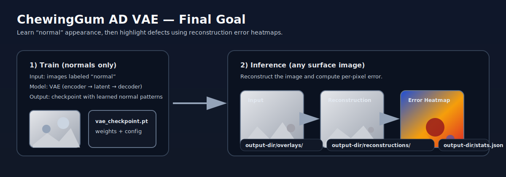
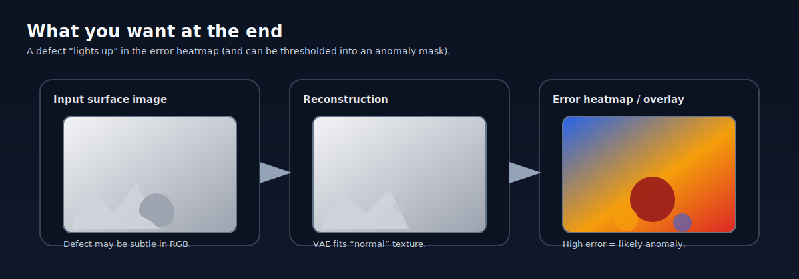

# ChewingGum AD VAE

Unsupervised anomaly detection for chewing-gum surface inspection using a Variational Autoencoder (VAE):
train the model to reconstruct **normal** surfaces, then detect defects via **reconstruction error heatmaps**.




## Final goal

Given a surface image, the system should:
1) reconstruct what a “normal” surface would look like,
2) compute per-pixel reconstruction error,
3) produce a heatmap/overlay (and optionally a binary mask via thresholding) that highlights defects.

## Project layout (relevant parts)

- `scripts/train.py`: training CLI (splits normals into train/val/test, logs to TensorBoard, saves checkpoints).
- `scripts/infer.py`: inference CLI (loads a checkpoint, saves reconstructions + overlays, writes `stats.json`).
- `scripts/model.py`: `ImprovedVAE` model + loss (`VGGPerceptualLoss` optional); `ResNetVAE` is an alias for compatibility.
- `scripts/data.py`: `ChewingGumDataset` that reads `data/image_anno.csv` and returns image/mask/label batches.
- `scripts/utils.py`: seeding, device selection, SSIM, checkpoint/JSON helpers, heatmap + overlay utilities.
- `artifacts/`: training outputs (checkpoints, TensorBoard logs, split metadata).

## Setup

Create a virtualenv and install dependencies:

```bash
python -m venv venv
source venv/bin/activate
pip install -r requierements.txt
```

This project assumes an NVIDIA GPU with a CUDA-enabled PyTorch build (ROCm/AMD GPU builds are not supported).

If your `pip install torch` pulled a CPU-only build, reinstall PyTorch with CUDA for your system (example for CUDA 12.1 wheels):

```bash
pip install --upgrade --force-reinstall torch torchvision --index-url https://download.pytorch.org/whl/cu121
```

## Train

Train a VAE on normal samples and validate on a held-out split:

```bash
python scripts/train.py --csv data/image_anno.csv --root .
```

Useful flags:
- `--save-dir artifacts/checkpoints_improved` (where checkpoints go)
- `--log-dir artifacts/tensorboard_improved` (TensorBoard logs)
- `--use-augmentation` (basic image augmentation)
- `--beta`, `--beta-warmup` (KL weight scheduling)
- `--latent-dim`, `--feature-size` (model capacity)

View training curves + sample reconstructions:

```bash
tensorboard --logdir artifacts/tensorboard_improved
```

## Inference

Run reconstruction + heatmap generation:

```bash
python scripts/infer.py --checkpoint artifacts/checkpoints_improved/<ckpt.pt> --csv data/image_anno.csv --root .
```

Inference outputs go to `artifacts/inference/` by default:
- `artifacts/inference/reconstructions/`: reconstructed images
- `artifacts/inference/overlays/`: heatmap overlays
- `artifacts/inference/stats.json`: per-image summary stats (+ IoU if masks exist)

If you trained with a non-default `--feature-size`, inference reads it from the checkpoint; you can override via `--feature-size`.

## Data format

The dataset is expected as a CSV (default: `data/image_anno.csv`) with columns:
- `image`: path to the RGB image (relative to repo root)
- `mask`: optional path to a binary/gray defect mask (empty if not available)
- `label`: `normal` or a defect label

Paths are resolved under `--root`, and CSV rows starting with `chewinggum/...` are also handled.
